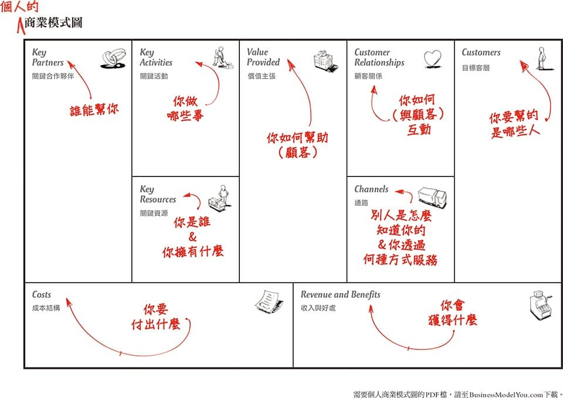

# 電子商務的商業模式 {#business_models}

## 商業模式的基本概念

簡單來說，**商業模式(business model)的用途是描述一個組織如何創造、傳遞及獲取價值的手段與方法。**商業模式(business model)包含了一系列要素及其關係的概念性工具，透過商業模式可以說明組織能為顧客提供的價值以及公司的內部結構、合作伙伴網路和關係資本（Relationship Capital）等各種的要素以及要素之間的關係，這些關係指的便是彼此間的物流、資訊流和金流。

以下透過「經理人」的[一張圖看懂商業模式，找出關鍵策略活動](https://www.managertoday.com.tw/articles/view/29827)，說明商業模式的要素：

1.目標客層（Customer Segments, CS）：企業或組織所要服務的一個或數個客群。

2.價值主張（Value Propositions, VP）：以種種價值主張，解決顧客的問題，滿足顧客的需要。

3.通路（Channels, CH）：價值主張透過溝通、配送及銷售通路，傳遞給顧客。

4.顧客關係（Customer Relationships, CR）：跟每個目標客層都要建立並維繫不同的顧客關係。

5.收益流（Revenue Streams, R$）：成功地將價值主張提供給客戶後，就會取得收益流。

6.關鍵資源（Key Resources, KR）：想要提供及傳遞前述的各項元素，所需要的資產就是關鍵資源。

7.關鍵活動（Key Activities, KA）：運用關鍵資源所要執行的一些活動，就是關鍵活動。

8.關鍵合作夥伴（Key Partnership, KP）：有些活動要借重外部資源，而有些資源是由組織外取得。

9.成本結構（Cost Structure, C$）：各個商業模式的元素都會形塑你的成本結構。

以較口語的方式表達上面的概念：

## B2C的商業模式

B2C的商業模式可分為：

1. 入口網站
2. 電子零售商
3. 網路內容提供者
4. 市場創造者與交易仲介商
5. 服務提供者
6. 社群提供者

### 入口網站

入口網站 (portal) 提供搜尋引擎讓使用者得以找到目的網站的轉運站，例如Google、Yahoo!、PChome等等。

具有競爭力的入口網站需具備以下特性：

- 具大量使用者基礎
- 使用者對品牌信任
- 具行銷力
- 具管理合作夥伴能力
- 具資訊技術經驗
- 具創新力
- 須承擔風險

入口網站的日漸普及與市場新利基的建立，使得使用者對網站專業性的需求提高，新科技行銷已走向客製化的一對一行銷，入口網站應考量｢如何提高會員註冊率」和｢如何保留住已註冊的會員」兩項重要課題。

### 電子零售商

電子零售商(e-tailer)即是線上的零售商站，規模大則如Amazon.com，小至一般小型地區性業者。規模大的電子零售商逐漸拓展實體通路走向虛實整合，例如[為何Amazon、阿里巴巴都搶開實體通路？](https://www.managertoday.com.tw/articles/view/55171)以及[超零售時代來臨，解析3大關鍵要素](https://www.bnext.com.tw/article/53150/-super-retail)兩則報導。規模小的業者則積極運用網拍，帶動流量與營收。

### 網路內容提供者

網路內容提供者(Internet content provider, ICP) 即是販賣內容、或以內容吸引會員，收取廣告為商業目標者，其收益來源即包括內容授權金、會員會費和網路廣告。其中的會員會費便是希望會員願意因為內容付費，然而網路使用者已經習慣於免費取得內容，要轉型為內容付費的模式，並不容易。例如，[紐約時報的數位化轉型](https://www.bnext.com.tw/article/43256/the-new-york-times)。

### 市場創造者與交易仲介商

市場創造者 (market creator)是指建立一個數位化的交易空間，讓買賣雙方可以會面、展示商品、搜尋商品，並可以相互議價，訂定商品價錢，交易仲介商 (transaction broker) 則是提供線上交易的服務項目，包括資訊流、金流、甚至物流，讓買賣雙方透過網站方便、快速完成繁複的交易程序。除了過去傳統的實體物、有價證券外，網路上也有許多數位商品的交易，例如：[粉絲團、網站與App等虛擬資產](https://www.bnext.com.tw/article/47682/taiwanese-startup-flipweb-helped-you-sell-digital-assets)或是[虛擬寶物](https://www.bnext.com.tw/article/49743/gamania-blockchain-iio)。

### 服務提供者

服務提供者 (service provider) 透過網路提供服務，其基本的價值主張就是提供消費者更具有價值、更便利、更省時、更低成本的選擇。例如，104人力銀行、Netflix。

### 社群提供者

社群提供者 (community provider)提供使用者社交互動、進行交談的數位化線上環境。

## B2B的商業模式

B2B主要是針對企業內部以及企業與上下游協力廠商之間的資訊整合，並在網際網路上進行的企業與企業間交易。

藉由企業內部網（Intranet）建構資訊流通的基礎，及外部網路（Extranet）結合產業的上中下游廠商，達到供應鏈的整合。

以簡化企業內部資訊流通的成本，更可使企業與企業之間的交易流程更快速、更減少成本的耗損。

商流：透過Internet進行企業間商業交易資訊交換，如採購單、商業發票及確認通知等，讓整個企業與企業間的「供應鏈」與「配銷商」管理自動化，以節省成本，增加效率，更有開發新市場的機會。

資訊流：交易進行的採購單及交易記錄，以電子表單形式記錄在資料庫中。

金流：電子資金轉移，如銀行與其往來企業間資金的自動轉帳。

物流：所有的出貨需求在經過資料庫處理後會自動完成物流配送的要求。

## 討論 {-}

訂閱制是指消費者支付一筆訂閱費用，獲得相關產品的服務，產品則有可能是數位內容、軟體、服務、衣物、奢侈品等，且消費者有停止訂閱的自由。，請從電子商務的商業模式觀點，討論[這則新聞](https://www.bnext.com.tw/article/53884/shiseido-optune-subscription-service)中，資生堂推行的護膚訂閱制。

1. 請先討論該B2C商業模式屬於哪一種類型。
2. 接著討論該商業模式的各個要素。

## 作業 {-}

1. 請對上次作業的電子商務平台，蒐集相關新聞與資料，討論該電子商務平台的各商業模式要素與其間的關係。
