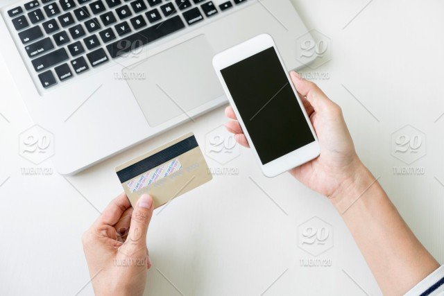

# 電子商務付費系統與安全機制 {#payment_system}

整個電子商務的交易流程是環繞在消費者、商店、金融單位與物流業者等四個主要部分間的商流、金流、物流與資訊流，其中金流便是消費者、商店與金融單位間有關金錢往來與交易的流通過程。電子商務的付費系統較傳統模式方便，但其安全也同樣令人擔憂，如何建立穩定安全的金流環境是電子商務的重要基石。

## 電子商務付費模式

目前常見的電子商務付費模式可分為非線上付費與線上付費兩大模式。

### 非線上付費

非線上付費包括傳統的劃撥轉帳、ATM轉帳、傳真刷卡以及貨到付款和超商代碼轉帳。其中貨到付款需要郵局或便利商店與物流業者的配合；超商代碼轉帳則會在消費者購買後產生一組繳費代碼，利用繳費代碼在超商的ibon或family port上，完成付費，然後取得服務。

非線上付費的問題包括；

- 離線處理比較不方便。

- 需要在網路上銀行帳號、信用卡號碼與個人身分等機密資料，較不安全。

- 信用卡只能再發卡銀行特約經銷商中交易流通，非特約經銷商則無法進行交易。

- 信用卡或支票需要一定的身分審核，並非人人都可達到合格標準而擁有帳戶。

- 小額交易不符成本考量。

### 線上付費

線上付費包括線上刷卡、電子現金、WebATM、電子票據、小額付款機制、第三方支付與虛擬貨幣。

- 線上刷卡：利用網站提供刷卡付費機制。消費者在網站上輸入信用卡號與基本資料，商店將資料送到信用卡收單銀行請求授權，只要經過許可，商店便可向銀行取得貨款。以信用卡為基礎的電子付款系統必須能夠確保客戶資料、信用卡號碼、交易內容等資料在網路上傳輸的安全，並且需要有公正的認證機構(例如信用卡發卡組織)對所有交易的個體發給身分認證，讓交易雙方可以在線上驗證對方身分，及利用認證上的公開金鑰進行資料交換，進行安全的信用卡付款交易。

- 電子現金：模擬一般現金付費模式，消費者先將貨幣數值轉換成加密的數位資料，使用電子現金付款時，再將數位資料轉換為金額。目前常見的電子現金付款模式包括智慧卡與電子錢包，[使用悠遊卡與i-cash等都是屬於這類應用](https://www.bnext.com.tw/article/4561/BN-ARTICLE-4561)。

- WebATM：晶片金融卡的網路收單服務，只要將晶片金融卡插入讀卡機，連結電腦上網到WebATM，就可以轉帳支付。

- 電子票據：以電子方式製成的票據，在支付及兌現的過程中使用個人及銀行的數位憑證。電子票據包括電子支票、電子本票和電子匯票。

- 小額付款機制：電信業者與網路服務業者提供小額付款平台，消費者只要輸入手機號碼與密碼，利用行動電話的個人化及安全機制，便可進行小額付款，費用會列入下期的電信帳單內收取。

- 第三方支付：在交易過程中，除了買賣雙方外，透過第三方來代收與代付款項。當買方選購商品後，利用第三方支付平台提供的帳戶，進行貨款支付。當貨款支付後，由第三方支付平台通知賣方貨款到款，要求發或。買方收到貨品，檢驗無誤後，即可通知第三方支付平台付款給賣方。著名的第三方支付，如PayPal與支付寶。

- 虛擬貨幣：一種無法律約束，由開發者發行與管控，在特定虛擬社群成員中接受和使用的數位貨幣。虛擬貨幣可以在某些虛擬社群中，像實體貨幣一樣運作的交換媒介，但不具備實體貨幣的所有屬性。比特幣(Bitcoin)便是一種不依靠某一個中央貨幣機構發行的全球通用加密虛擬貨幣。比特幣由特定演算法通過大量計算(稱為挖礦)產生。比特幣不僅是一種資產，也可以視為是一種支付方式，透過私鑰作為數位簽章，允許個人直接支付給他人，與現金相同，不需經過如銀行等第三方機構，從而避免了高手續費、繁瑣流程以及受監管性的問題，任何用戶只要擁有可連線網際網路的數位裝置皆可使用。

## 行動支付

通過手機等行動裝置對於消費商品或服務進行帳務支付的一種方式，換句話說，便是可以在不需使用現金、支票或信用卡的情況下，消費者可使用行動裝置支付各項服務或數位及實體商品的費用。

根據資策會的「行動支付大調查」，去年台灣行動支付的普及率已經突破五成，在18至45歲的智慧型手機用戶中，更是已經突破六成。目前台灣的主要行動支付方式包括感應支付(NFC)和QR Code掃碼支付。

### 感應支付(NFC)
感應支付是利用近場通訊(Near-field communication, NFC)進行行動支付，經常在實體商店或交通設施中使用。消費者須使用配備有智慧卡的行動電話，並將行動電話置於感應器模組前。大多數的交易並不需要額外授權，但也有部分交易在完成前要求輸入密碼或使用指紋授權。支付的款項可由預付帳戶或銀行帳戶中扣除，或計入電信費用中收取。

使用感應支付做為付款方式的行動支付有Google Pay、Apple Pay及Samsung Pay等。Apple Pay及Samsung Pay使用手機原本內建的Wallet綁定信用卡即可，Android Pay則是需要透過Google Play下載App再綁定信用卡。目前只要有支援NFC感應支付的店家都可透過上述三種裝置支付。

### QR Code掃碼支付

消費者僅需下載商家提供之APP，並完成身分驗證與鍵入卡片資訊後，即能使用手機行動消費。此後，不論使用任何廠牌的智慧型手機，也不論是在實體商家或網路商城進行購物，都可拿起手機、開啟APP、選擇欲使用的信用卡或金融卡，再將手機鏡頭對準商品、型錄或海報上的二維條碼完成掃描，就可完成付款。

QR Code掃碼支付具有3大優勢：

1. **不限智慧型手機機種**。只要是智慧型手機、平版即可進行掃碼，不受限是Android或iOS系統，也不須持有NFC感應功能的高階手機。

2. **建置成本低廉**。交易設備不限在「感應式刷卡機」，店家只須出示QR Code條碼，消費者就能透過手機的相機完成交易，硬體建置成本相當低廉。

3. **使用功能多元**。「QR Code」交易時可順便掃描電子發票手機載具，步驟簡單，還能綁定各式會員卡進行集點回饋，加上電子支付開放連結銀行帳戶，親友間即能以掃碼方式轉帳、分帳，且不須支付轉帳手續費，可達到「免掏錢包」的無現金生活。

使用QR Code掃碼做為付款方式的行動支付有Line Pay、街口支付、台灣Pay等。然而[共通性是QR Code掃碼支付能否普及的重要關鍵，因此，萬事達卡、Visa、銀聯卡、JCB、AE等國際信用卡組織，共同發起發起了一個共通QR Code標準EMV QR Code](https://www.bnext.com.tw/article/53753/visa-chris-clark-cashless-strategy)。

## 電子商務交易安全機制

目前電子商務發展最大的考驗就是線上交易安全。敏感的個人及財務資訊在網際網路上傳送時，如果有可能被第三者竊取或變造，將會讓消費者對於線上付款沒有安全感，因此便不會輕易在網路上購買商品或服務。而商家為了避免發生交易糾紛，也就不敢冒然提供線上購物的服務。若要電子商務蓬勃地成功發展，則必須確保網路交易的安全，建立消費者對交易可靠性的信心。所以，交易安全是目前電子商務發展中，急待克服且深受囑目的問題。以下介紹兩種目前線上交易中最常見的安全機制

### TSL協定以及其前身SSL協定

網景公司(Netscape)在1994年推出Navigator瀏覽器時，推出HTTPS協定，以SSL (Secure Sockets Layer) 對Web上的傳輸進行加密，這是SSL的起源。IETF將SSL進行標準化，1999年公布第一版TLS(Transport Layer Security)標準檔案，TSL的最新版本是TSL1.3。目前TSL已成為網際網路上保密通訊的工業標準。在瀏覽器、電子郵件、即時通訊、VoIP、網路傳真等應用程式中，廣泛支援這個協定。主要的網站，如Google、Facebook等也以這個協定來建立安全連線，傳送資料。

TLS協定採用主從式架構模型，用於在兩個應用程式間透過網路建立起安全的連線，防止在交換資料時受到竊聽及篡改。

TLS協定的優勢是與高層的應用層協定（如HTTP、FTP、Telnet等）無耦合。應用層協定能透明地執行在TLS協定之上，由TLS協定進行建立加密通道需要的協商和認證。應用層協定傳送的資料在通過TLS協定時都會被加密，從而保證通訊的私密性。

### SET協定

SET(Secure Electronic Transaction)是一種用於確保網路信用卡交易安全的通信協定標準。SET由萬事達卡(MasterCard)與Visa共同制定，並獲得IBM、Microsoft、HP和其他公司的支持。SET的做法是再進行交易前，消費者與商家都必須預先向憑證管理中心取得各自的SET數位認證資料。憑證管理中心會核發一個數位簽章，然後並使用數位認證和數位簽章的組合在消費者、商家和發卡銀行之間進行交易和驗證。其優點是由憑證管理中心負責將交易資料分開傳送給商家和發卡銀行，商家不知道消費者的卡號，發卡銀行則不知道消費的交易內容，以確保隱私和機密性。

VISA、MasterCard、JCB 現在則推廣3D 安全驗證的網路安全認證服務，3D的名稱由來為在商家的收單銀行(Acquirer domain)、信用卡組織(Interoperability domain)與消費者的發卡銀行(Issuer domain)等3個領域(Domains)的安全認證傳遞協定。

從消費者這邊來看3D 安全驗證：

1. 消費者在輸入信用卡資訊後，先進入 3D 安全驗證畫面。
3. 消費者可選擇輸入「於網銀預先設定」的靜態驗證碼，亦或者是接收動態驗證碼的簡訊。
4. 消費者於限定的時間內輸入正確的靜態或動態驗證碼，發卡銀行才會判斷是否回傳授權。
5. 當發卡銀行確認資訊及驗證碼無誤，回傳授權成功，然後進行付款。

## 討論 {-}

[PayPal執行長丹·舒爾曼（Dan Schulman）於2018年說過，信用卡將在20年後被行動支付取代](https://www.bnext.com.tw/article/53179/will-credit-card--disappear)。請對此發表你的看法。

## 作業 {-}

如何申請SSL憑證？
