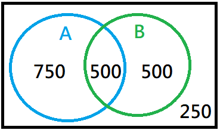

#購物籃分析 {#market-basket-analysis}

https://towardsdatascience.com/a-gentle-introduction-on-market-basket-analysis-association-rules-fa4b986a40ce

##購物籃分析簡介

**購物籃分析(market basket analysis)**又稱**關連分析(association analysis)**，其目的是從大量的交易資料中，探勘出隱藏在資料間具有相關性的關連規則(association rules)。這些關連規則表示消費者通常買什麼，哪些商品經常會被一起購買。購物籃分析最經典的就是啤酒與尿布的例子。

###購物籃分析的概念

購物籃分析的演算概念主要為兩個機率統計量的計算，分別為**支持度(support)**和**信賴度(confidence)**。以下用一個例子來說明支持度和信賴度的意義與計算方式。如下圖所示，假定所有的發票共有2000筆(以下以$C$代表)，包含A產品的發票有1250(750+500)筆(以$C_{A}$代表)，包含B產品的發票則有1000(500+500)筆(以$C_{A}$代表)，同時包含A產品與B產品的發票有500筆。



我們想計算如果購買A產品時也一起購買B產品(購物籃分析將這條關連規則表示成${A}\Rightarrow{B}$)時的支持度與信賴度：

- 支持度(Support) ：
在所有的發票中，同時購買A、B產品的次數比例 $Pr(A, B)=\frac{C_{A, B}}{C}=\frac{500}{2000}=0.25$
如果支持度大，表示顧客很有可能同時購買A、B產品。

- 信賴度(Confidence) ：
在購買A產品的發票中，同時也購買B產品的次數比例 $Pr(B|A)=\frac{Pr(A,B)}{Pr(A)}=\frac{\frac{C_{A, B}}{C}}{\frac{C_{A}}{C}}=\frac{\frac{500}{2000}}{\frac{1250}{2000}}=0.4$
如果信賴度大，表示顧客在購買A產品時也很有可能同時購買B產品，但反之，購買B產品時並不一定同時購買A產品。

在進行購物籃分析時，需要先設定最小支持度與最小信賴度。如果所設定的最小支持度與最小信賴度太低，則會產生太多關連規則，造成決策上的干擾。反之，最小支持度與最小信賴度的設定太高則可能會面臨關連規則找出太少而造成難以應用的窘境。

一個強關聯規則，通常支持度和信賴度的值都很高。但支持度和信賴度值高的規則，卻不一定代表這條規則所指的事件彼此間就一定存在著高相關性。同時還需檢查**增益率(lift)**的值是否大於1。

  - 當增益度的值＞1， 則A與B間有正向關係
  - 當增益度的值＝1， 則A與B間沒有關係
  - 當增益度的值＜1， 則A與B間為負向關係

增益率的計算方式：$\frac{Pr(B|A)}{Pr(B)}=\frac{Pr(A,B)}{Pr(A){\times}Pr(B)}$

##購物籃分析的應用
以下我們將利用R語言的arules套件分析Online Retail.xlsx資料集。如同前面幾次課程，這個資料集包括發票編號(InvoiceNo)、貨品編號(StockCode)、描述(Description)、數量(Quantity)、發票日期(InvoiceDate)、單價(UnitPrice)、顧客識別號(CustomerID)、國別(Country)等變數欄位。我們以同一個發票編號的發票做為一次交易，分析哪些貨品比較可能會一起購買。

###資料的讀入與預處理

首先載入套件，如果第一次使用`arules`和`arulesViz`套件，需要先使用`install.packages()`安裝套件。
```{r}
library(tidyverse)
library(lubridate) #處理時間資料
library(readxl) #讀取excel檔案
library(arules)
library(arulesViz)
```

讀取資料集檔案[線上零售資料集](https://archive.ics.uci.edu/ml/datasets/Online+Retail)
```{r}
Online_Retail <- read_excel("Online Retail.xlsx")
```

首先，去除顧客識別號(CustomerID)資料中的NA(Not-Available)，保留非NA的資料，然後再選取發票日期(InvoiceDate)在2010-12-09到2011-12-09之間的資料，最後選取購物部分的發票資料(刪除取消部分的發票)。
```{r}
Online_Retail <- Online_Retail %>%
  filter(!is.na(CustomerID)) %>% #去除去除顧客識別號中的NA
  filter(InvoiceDate>=as.POSIXct("2010-12-09", tz="UTC")) %>% #選取2010-12-09到2011-12-09之間的資料
  filter(!grepl("C", InvoiceNo)) #選取購物部分的發票資料
```

### 將發票資料轉換成arule可以讀取的格式

首先取出發票編號和貨品描述兩個欄位，將這些交易資料寫入一個暫存檔
```{r}
Online_Retail %>%
  select(InvoiceNo, Description) %>% #選取發票編號和貨品描述兩個欄位
  write.table(file = "tmp", row.names = FALSE) #寫入一個暫存檔
```

將暫存檔中的交易資料以arule的格式讀出
```{r}
trans <- read.transactions("tmp",
                           format = "single",
                           header = TRUE,
                           cols = c("InvoiceNo", "Description")) #讀出交易資料
unlink("tmp") #刪除暫存檔
```

### 檢視交易資料

利用`summary()`函數查看交易紀錄
```{r}
summary(trans)
```
結果共有17858筆交易，3819種貨品。
較常購買的商品有WHITE HANGING HEART T-LIGHT HOLDER、REGENCY CAKESTAND 3 TIER、


```{r}
itemFrequencyPlot(trans, topN=20, type='absolute')
```

